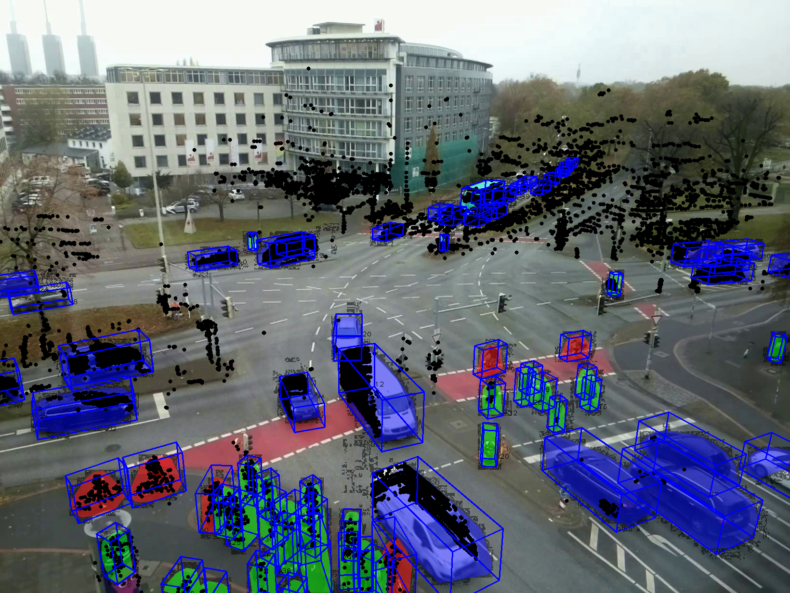
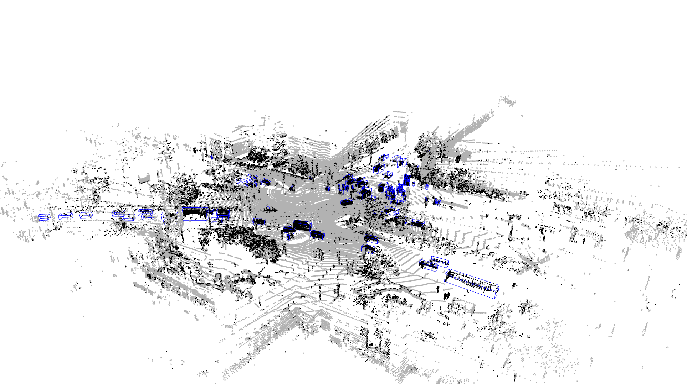
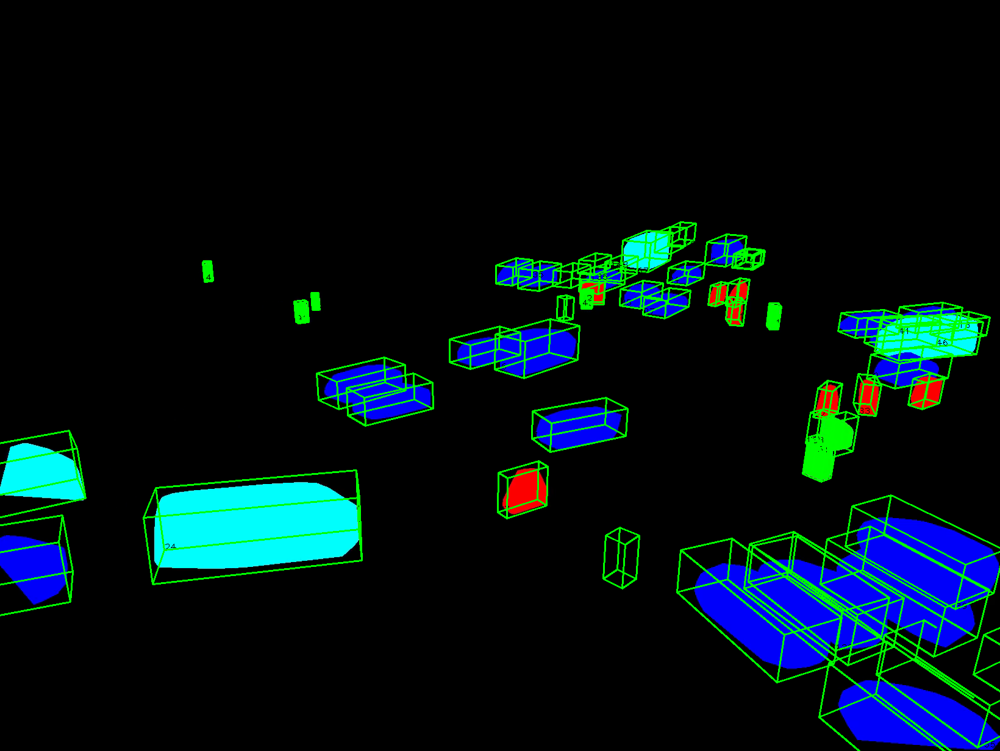

# LUMPI SDK

Welcome to the LUMPI SDK repository. This SDK provides tools, examples, tutorials, and classes to help you get started with the [LUMPI dataset](https://data.uni-hannover.de/dataset/lumpi).

## Table of Contents
- [Installation](#installation)
- [Examples](#examples)
- [Tutorials](#tutorials)
- [Objects](#objects)
- [Labels](#labels)
- [Masks](#masks)
- [Contributing](#contributing)
- [License](#license)

## Installation
To install the LUMPI SDK, follow these steps:
1. Clone the repository:
    ```sh
    git clone https://github.com/St3ff3nBusch/LUMPI-SDK-Python.git
    ```
2. Navigate to the project directory:
    ```sh
    cd LUMPI-SDK-Python
    ```
3. Install the required dependencies:
    ```sh
    pip install -r requirements.txt
    ```
4. To start the example, run from the LUMPI-SDK-Python root directory:
    ```sh
    python -m examples.[example_script_name]
    # Replace [example_script_name] with the desired example script name
    ```
    E.g., **python -m examples.label_only_example**
## Examples
The **examples directory** contains scripts to display images, masks, bounding boxes, and point clouds using the LUMPI SDK. For instance, **camera-example.py** demonstrates how to visualize camera data, including images and masks. Similarly, **point_cloud_example.py** shows how to visualize point clouds. It uses the **LumpiParser** to load point cloud data and the **PointCloudFilter** to segment the background. 
  
The **PointCloudVisualizer** is then used to display the point clouds and draw 3D bounding boxes, with the background colored black and the foreground colored gray. You can find the scripts [here](examples). A small `test data set` is provided [here](https://seafile.cloud.uni-hannover.de/f/0f3c07a71b1949fe90c2/?dl=1) to test the SDK.<p float="left">
  
</p>


Additionally, the **camera_label_only_example.py** and **point_cloud_label_only_example.py** script demonstrates how to work with labels independently of point clouds or images. It shows how to load label data using the **LumpiParser**, allowing you to inspect the label data before downloading the sensor data. The fastest way to get an overview over the label is the **point_cloud_label_only_example.py** script because it shows only the raw 3D bounding boxes 

You could download all labels [here](https://data.uni-hannover.de/vault/ikg/busch/LUMPI/labels.zip) and display them directly with this script.
 
 

A more detailed description is given by the following [tutorials](#tutorials).

## Tutorials
Check out the **tutorials** directory for step-by-step guides on how to use the LUMPI SDK effectively.
- [LUMPI Label Only Tutorial](notebooks/label_only_tutorial.ipynb)
- [LUMPI Point Cloud Tutorial](notebooks/point_cloud_tutorial.ipynb) 
- [LUMPI Camera Tutorial](notebooks/camera_tutorial.ipynb)

## Objects
The **objects directory** contains helper classes to efficiently load LUMPI data.
- The `LumpiParser` provides methods to load point clouds and labels, as well as methods for pose interpolation.
- The `PointCloudFilter` provides methods to load the background filter matrices and to get segment point clouds with back- and foreground or time intervals.
- The `CameraViewer` stores the camera parameters, video, and mask-video captures. It also provides methods to project the 3D labels into the respective camera view considering frustum box culling.

## Labels
Not all labels were manually corrected; those that were are marked with a **score** of 4.
The 555 hour label effort was focused on Measurements 4, 5, and 6 due to the denser point clouds.
You could download the labels [here](https://data.uni-hannover.de/vault/ikg/busch/LUMPI/labels.zip). 

The labels are provided as a CSV file with the following columns:
- **time** in seconds
- **object id** unique for each object
- **2D rectangle: top left x** coordinate of bird's eye view rectangle
- **top left y** coordinate of bird's eye view rectangle
- **width** of bird's eye view rectangle
- **height** of bird's eye view rectangle
- **score** 4 marks manually corrected labels
- **class_id**  0=person, 1=car, 2=bicycle, 3=motorcycle, 4=bus, 5=truck and 6=unknown
- **visibility** number of points in box
- **3D box: center x** coordinate (UTM)
- **y** coordinate (UTM)
- **z** coordinate (UTM)
- **length** in meters
- **width** in meters
- **height** in meters
- **heading** in radians
- **[optional arbitrary many double: shape parameter or point index or embeddings]** empty (useful for the labeling process)

## Masks
The masks are provided as additional video. All points within the manually corrected bounding boxes of a track are aggregated and projected into the box coordinate system. The 3D convex hull for all these points per object is then calculated. This hull is projected with the interpolated box pose into the camera frame, and its 2D convex hull for this frame is calculated. All 2D convex hulls are drawn, ordered by their distance to the camera, into the mask frame.

**Note:** For measurements 4, 5, and 6, only masks for the corrected objects are provided because masks of non-corrected objects may occlude the corrected masks. In contrast, for measurements 0-3, we provide masks for the automatically generated labels.


## License
This project is licensed under the MIT License - see the [LICENSE](LICENSE) file for details.
